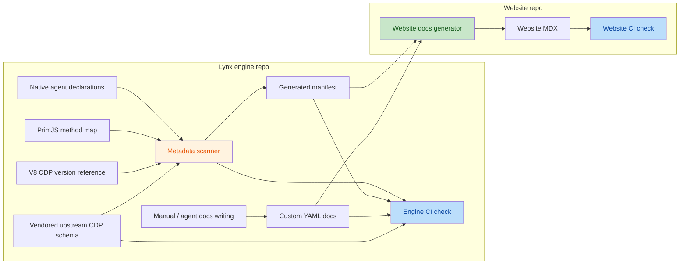

# DevTool CDP Metadata Workflow

## Workflow



## Target Files

- `devtool/lynx_devtool/protocol/cdp_manifest.generated.yaml`
  - Generated inventory of locally supported CDP methods and future CDP entries such as events.
  - Contains engine-owned external CDP references, such as the V8 CDP documentation root adopted by Lynx.
  - Rewritten by the update script.
  - Do not edit by hand.
- `devtool/lynx_devtool/protocol/custom_cdp_docs/`
  - Human-maintained docs data for Lynx-extension CDP entries.
  - Written manually or by agents; not generated by the metadata update script.
  - Contains one YAML file per documented Lynx-extension method or event.
  - Uses `Domain/methods/method.yaml` paths for methods, such as `DOM/methods/getDocumentWithBoxModel.yaml`.
  - Future Lynx-extension events should use `Domain/events/event.yaml` paths.
- `devtool/lynx_devtool/protocol/cdp_upstream/protocol.json`
  - Vendored Chrome DevTools Protocol schema.
  - Generated by `devtool/lynx_devtool/protocol/scripts/update_cdp_upstream.py`.
  - Updated deliberately, not fetched during normal CI.
- `devtool/lynx_devtool/protocol/cdp_upstream/README.md`
  - Source, version, license, and update notes for the vendored CDP schema.
- `devtool/lynx_devtool/protocol/cdp_upstream/LICENSE`
  - License text copied from the vendored CDP schema source.
- `devtool/lynx_devtool/protocol/scripts/update_cdp_metadata.py`
  - Scans source code and updates or checks generated metadata.
- `devtool/lynx_devtool/protocol/scripts/update_cdp_upstream.py`
  - Builds and normalizes the vendored Chrome DevTools Protocol schema from upstream protocol JSON files.

## Metadata Update Script Modes

```bash
tools/env.sh python3 devtool/lynx_devtool/protocol/scripts/update_cdp_metadata.py --write
tools/env.sh python3 devtool/lynx_devtool/protocol/scripts/update_cdp_metadata.py --check
```

- `--write`
  - Scans native domain agents and the PrimJS runtime method map.
  - Compares local methods with vendored standard CDP.
  - Rewrites `cdp_manifest.generated.yaml`.
- `--check`
  - Runs the same scan.
  - Builds expected generated metadata in memory.
  - Fails if the checked-in generated YAML is stale.
  - Prints the command developers should run to update it.

## Upstream Schema Update Script Modes

```bash
tools/env.sh python3 devtool/lynx_devtool/protocol/scripts/update_cdp_upstream.py --check
tools/env.sh python3 devtool/lynx_devtool/protocol/scripts/update_cdp_upstream.py \
  --write \
  --revision <devtools-protocol-commit>
tools/env.sh python3 devtool/lynx_devtool/protocol/scripts/update_cdp_upstream.py \
  --write \
  --browser-protocol [BROWSER_PROTOCOL_JSON] \
  --js-protocol [JS_PROTOCOL_JSON]
```

- `--check`
  - Without input files, validates that `cdp_upstream/protocol.json` is in the canonical generated JSON format.
  - With `--revision` or local input files, builds expected generated schema in memory and fails if the checked-in schema differs.
- `--write`
  - Requires either `--revision` or both local upstream protocol files.
  - Combines upstream `json/browser_protocol.json` and `json/js_protocol.json`.
  - Rewrites `cdp_upstream/protocol.json` with deterministic two-space JSON formatting and a trailing newline.

## Website Docs Generation

Website documentation is generated in the website repository from `cdp_manifest.generated.yaml` and `custom_cdp_docs/`; the website repository owns the generator script, MDX structure, presentation, and website CI check.

## Source Scan Scope

Scan non-forwarding native domain agents:

- `devtool/lynx_devtool/agent/domain_agent/*.cc`
- Exclude `*_unittest.cc`.
- Extract entries matching `functions_map_["Domain.method"]` or direct
  `if (method == "Domain.method")` branches in an agent's `CallMethod` function.
- Store the declaration file as `source` for each extracted method.
- Do not use forwarding-only JS-engine domain agents as method inventory sources.
  - `Debugger`, `Runtime`, `HeapProfiler`, and `Profiler` are registered as DevTool domains, but their domain agents forward requests through `devtool_mediator_->DispatchJSMessage(...)`.
  - `Debugger` may also contain local pre-hook methods before forwarding. Treat those entries as forwarding hooks, not as complete method support declarations.

Scan the PrimJS runtime CDP method map:

- `third_party/quickjs/src/src/inspector/protocols.cc`
- Extract method keys from `debugger_function_map` in `GetDebugFunctionMap()`.
- Store the map file as `source` for each extracted method.
- These entries represent the PrimJS inspector implementation. Use the listed source path only as implementation evidence.
- Do not add per-method runtime availability fields. Website docs can explain globally that PrimJS is used for both Main-Thread Scripting and Background-Thread Scripting.

Record the V8 external CDP reference:

- V8-backed runtime CDP is delegated to V8 Inspector and should not generate per-method entries from Lynx source.
- Store the engine-adopted V8 CDP documentation root under `externalReferences.v8.cdpRoot`.
- Current value is hardcoded as `https://chromedevtools.github.io/devtools-protocol/1-3`.
- Update this value when Lynx upgrades the adopted V8 Inspector protocol version.
- Do not scan or parse V8 source code for this workflow.

Scan domain registration:

- `devtool/lynx_devtool/lynx_devtool_ng.cc`
- Extract `RegisterAgent("Domain", ...)`.
- Use registration location to mark domain scope:
  - `global`
  - `instance`
  - `global-and-instance`

Do not infer detailed API docs from C++ implementation bodies. Use the scan only for inventory and source links.
Do not scan arbitrary string literals, unlisted engine implementation maps, or one-off protocol checks as supported CDP entries.
If a method or event is not declared in a scanner-friendly place, treat it as unsupported by this metadata flow until the implementation adds a proper declaration.

## Deferred Scope

These are intentional current boundaries rather than task records.

- Runtime-backed CDP inventory is limited to the PrimJS method map.
  - JavaScriptCore is omitted because Lynx does not support CDP in JSC.
  - V8 is represented only by `externalReferences.v8`; do not emit V8 per-method entries.
  - Do not add per-engine availability metadata. Keep method rows as `name`, `origin`, and `source`.
- Structured lifecycle metadata is outside the generated schema.
  - Do not emit `lifecycle` in `cdp_manifest.generated.yaml`.
  - Document compatibility, deprecation, experimental status, and behavior differences as prose in `custom_cdp_docs/`.
  - Add structured lifecycle only together with an authoritative declaration contract and scanner validation rules.

Future discussion reference:

- Consider a lightweight CDP declaration framework so code declares support through a uniform DSL instead of the current heuristic scanner.
- The declaration should be compile-checked but should not become a runtime registry. It can use macros around small enum values for `scope`, `engine`, and `lifecycle`.
- Example shape:

  ```cpp
  LYNX_CDP_METHOD(Runtime, evaluate, kInstance, kPrimJS, kActive)
  LYNX_CDP_METHOD(DOM, getDocument, kInstance, kEngineIndependent, kActive)
  LYNX_CDP_EVENT(Runtime, consoleAPICalled, kInstance, kPrimJS, kActive)
  ```

- `origin` should still be generated by comparing declarations with the vendored upstream CDP schema, not declared in C++.
- Native domain agents should declare their native CDP entries near their implementation; runtime-backed implementations such as PrimJS and future runtimes should declare only the entries they actually implement.
- A future migration scanner should cross-check legacy implementation maps, such as `functions_map_`, against declarations so undeclared implemented methods are detected.
- Header placement is unresolved. `devtool/lynx_devtool/protocol/cdp.h` is natural for Lynx DevTool agents, but it may be an awkward dependency for third-party runtime code. A matching runtime-local declaration header can keep PrimJS independent from Lynx while still giving the scanner deterministic method and event names.
- The declaration header must be lightweight and dependency-neutral: enum values and macros only, with no JSON, dispatcher, `CDPDomainAgentBase`, or LynxDevTool mediator dependency.

## Controlled Field Values

Generated metadata enum fields are closed sets. The generator and `--check` mode must reject values not listed in this document. Adding a new value requires updating this section and the validator in the same change.

- `origin`: `standard`, `lynx-extension`
- `scope`: `global`, `instance`, `global-and-instance`

## Classification Rules

Use `Domain.method` as the stable key for methods.
If event scanning is added later, use the same origin values and keep entry type explicit in the generated metadata.

- `origin: standard`
  - The domain and method exist in vendored CDP.
  - Website docs should link to the official CDP method or domain.
- `origin: lynx-extension`
  - The domain or method is provided by Lynx and does not exist in vendored CDP at the same metadata location.
  - If this value is on a domain, the whole domain is a Lynx extension to CDP.
  - If this value is on a method inside a `standard` domain, the method is a Lynx extension to that standard CDP domain.
  - Website docs must be generated from `custom_cdp_docs/`.

## Generated Metadata Shape

```yaml
version: 2
generatedFrom:
  chromeDevToolsProtocol: cdp_upstream/protocol.json
upstreamRoot: https://chromedevtools.github.io/devtools-protocol/tot
externalReferences:
  v8:
    displayName: V8
    cdpRoot: https://chromedevtools.github.io/devtools-protocol/1-3
domains:
  - name: DOM
    origin: standard
    scope: instance
    methods:
      - name: getDocument
        origin: standard
        since: '4.1'
        source: devtool/lynx_devtool/agent/domain_agent/inspector_dom_agent_ng.cc
      - name: getDocumentWithBoxModel
        origin: lynx-extension
        since: '4.1'
        source: devtool/lynx_devtool/agent/domain_agent/inspector_dom_agent_ng.cc
  - name: Recording
    origin: lynx-extension
    scope: instance
    methods:
      - name: start
        origin: lynx-extension
        since: '4.1'
        source: devtool/lynx_devtool/agent/domain_agent/inspector_recording_agent_ng.cc
  - name: Runtime
    origin: standard
    scope: instance
    methods:
      - name: evaluate
        origin: standard
        since: '4.1'
        source: third_party/quickjs/src/src/inspector/protocols.cc
      - name: getHeapUsage
        origin: standard
        since: '4.1'
        source: third_party/quickjs/src/src/inspector/protocols.cc
```

Rules:

- Do not store derived entry keys. Method keys are derived as `<domain.name>.<method.name>`.
- Do not store per-domain or per-method upstream URLs.
- Do not store `domains.sources`.
- Do not store per-method runtime availability fields.
- Do not store domain-level `since`; domains are grouping namespaces.
- `methods[].since` is mandatory.
- Future `events[].since` is mandatory.
- Store `since` as a single-quoted string, such as `'4.1'`, not as a YAML number.
- Website docs own global prose for PrimJS MTS/BTS behavior and V8 delegated behavior.
- Derive standard CDP links from `upstreamRoot`:
  - Domain page: `<upstreamRoot>/<Domain>/`
  - Method: `<upstreamRoot>/<Domain>/#method-<method>`
  - Event, when event scanning is added: `<upstreamRoot>/<Domain>/#event-<event>`
- Derive V8 external reference links from `externalReferences.v8.cdpRoot` if the website needs V8-specific links:
  - Domain page: `<externalReferences.v8.cdpRoot>/<Domain>/`
  - Method: `<externalReferences.v8.cdpRoot>/<Domain>/#method-<method>`

## Manual Docs Shape

Each Lynx-extension method has one docs file:

```text
devtool/lynx_devtool/protocol/custom_cdp_docs/Memory/methods/getAllMemoryUsage.yaml
```

```yaml
summary: Gets global Lynx memory usage across live registered Lynx instances.
parameters:
  - name: timeoutMs
    type: number
    optional: true
    description: Non-negative timeout in milliseconds. `0` or omission lets the platform choose its default wait policy. Maximum accepted value is `300000`.
returns:
  - name: collectionStatus
    type: string
    enum: [completed, timeout]
    description: Whether all expected instance fetchers completed.
  - name: totalBytes
    type: number
    description: Global Lynx-attributed bytes, excluding `appBytes` and deduplicating shared background runtime groups.
  - name: appBytes
    type: number
    description: Current app memory footprint sampled by the platform.
  - name: instances
    type: array
    description: Completed instance list, sorted by `totalBytes` descending.
events: []
notes:
  - Send this method to the global DevTool handler with session ID `-1`.
  - This method differs from `Runtime.getHeapUsage`, which only reports JavaScript heap usage for one session/thread.
examples:
  - title: Use the platform default timeout
    request:
      id: 1
      method: Memory.getAllMemoryUsage
  - title: Use an explicit timeout
    request:
      id: 2
      method: Memory.getAllMemoryUsage
      params:
        timeoutMs: 50000
```

Rules:

- Every `lynx-extension` method must have a matching entry.
- `standard` methods do not need manual docs unless Lynx behavior differs from upstream.
- Manual docs are keyed by path: `custom_cdp_docs/<Domain>/methods/<method>.yaml`.
- Future Lynx-extension events should use `custom_cdp_docs/<Domain>/events/<event>.yaml`.
- A standard method may have a docs file only for Lynx-specific notes or behavior differences.
- The metadata check or website generator should fail if a docs file has no matching metadata method.
- The metadata check or website generator should fail if a required manual docs entry is missing.

## CI Check

Pre-submit should run:

```bash
tools/env.sh python3 devtool/lynx_devtool/protocol/scripts/update_cdp_upstream.py --check
tools/env.sh python3 devtool/lynx_devtool/protocol/scripts/update_cdp_metadata.py --check
```

Expected CI behavior:

- Fail if `cdp_upstream/protocol.json` is not in generated canonical JSON format.
- Fail if code scan output differs from `cdp_manifest.generated.yaml`.
- Fail if generated metadata contains Lynx-extension methods missing from `custom_cdp_docs/`.
- Do not fetch network resources.
- Do not modify files.
- Print the local update command.

Failure message format:

```text
DevTool CDP metadata is stale.
Run:
  tools/env.sh python3 devtool/lynx_devtool/protocol/scripts/update_cdp_metadata.py --write
Then review and commit:
  devtool/lynx_devtool/protocol/cdp_manifest.generated.yaml
  devtool/lynx_devtool/protocol/custom_cdp_docs/
```

## Developer Update Flow

1. Change DevTool CDP implementation code.
2. Run:

   ```bash
   tools/env.sh python3 devtool/lynx_devtool/protocol/scripts/update_cdp_metadata.py --write
   ```

3. Review generated diff in `cdp_manifest.generated.yaml`.
4. If new Lynx-extension methods were added, update `custom_cdp_docs/`.
5. Run:

   ```bash
   tools/env.sh python3 devtool/lynx_devtool/protocol/scripts/update_cdp_metadata.py --check
   ```

6. If updating website docs, follow the website repository CDP docs generator workflow against `devtool/lynx_devtool/protocol/`.

## Vendored CDP Update Flow

1. Pick the desired Chrome DevTools Protocol commit.
2. Regenerate the vendored schema:

   ```bash
   tools/env.sh python3 devtool/lynx_devtool/protocol/scripts/update_cdp_upstream.py \
     --write \
     --revision <devtools-protocol-commit>
   ```

   If network fetch is not available, download upstream `json/browser_protocol.json` and `json/js_protocol.json` by other means, then run:

   ```bash
   tools/env.sh python3 devtool/lynx_devtool/protocol/scripts/update_cdp_upstream.py \
     --write \
     --browser-protocol [BROWSER_PROTOCOL_JSON] \
     --js-protocol [JS_PROTOCOL_JSON]
   ```

3. Update `devtool/lynx_devtool/protocol/cdp_upstream/README.md` with the upstream commit metadata.
4. Run:

   ```bash
   tools/env.sh python3 devtool/lynx_devtool/protocol/scripts/update_cdp_upstream.py --check
   tools/env.sh python3 devtool/lynx_devtool/protocol/scripts/update_cdp_metadata.py --write
   tools/env.sh python3 devtool/lynx_devtool/protocol/scripts/update_cdp_metadata.py --check
   ```

5. Review methods whose origin changed.
6. Update docs data if a method moves between standard and custom classifications.

## V8 CDP Reference Update Flow

The V8 CDP reference is engine-owned metadata because it reflects the V8 Inspector protocol version adopted by Lynx. The website repository should consume it, not own it.

1. When Lynx upgrades the adopted V8 Inspector protocol version, update the hardcoded `externalReferences.v8.cdpRoot` value used by the metadata update script.
2. Current value:

   ```yaml
   externalReferences:
     v8:
       displayName: V8
       cdpRoot: https://chromedevtools.github.io/devtools-protocol/1-3
   ```

3. Regenerate and check generated metadata:

   ```bash
   tools/env.sh python3 devtool/lynx_devtool/protocol/scripts/update_cdp_metadata.py --write
   tools/env.sh python3 devtool/lynx_devtool/protocol/scripts/update_cdp_metadata.py --check
   ```

## Availability Notes

Generated metadata reflects method implementation in source code. It does not model compile-time configuration, runtime configuration, session state, parameter validation, or method-specific error behavior.

When conditional availability, deprecation, or behavior differences matter to users, document them in the matching file under `custom_cdp_docs/`.

Known examples:

- `Recording.start`, `Recording.end`
  - Note in manual docs that recorder support must be enabled in the current runtime.
- `Replay.start`, `Replay.end`
  - Note in manual docs that replay support must be enabled in the current runtime.
- `Log.enable`, `Log.disable`, `Log.clear`
  - Note in manual docs that messages with `sessionId` return not implemented.
- `Template.templateConfigInfo`
  - Note in manual docs that this is a compatibility stub returning an empty result because config info was removed.
